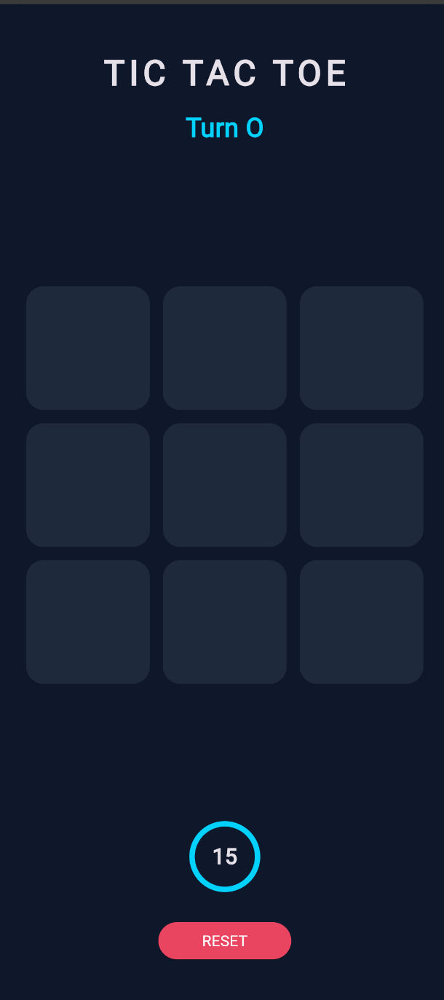
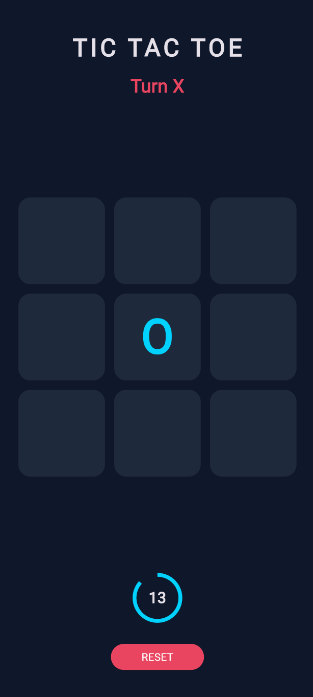
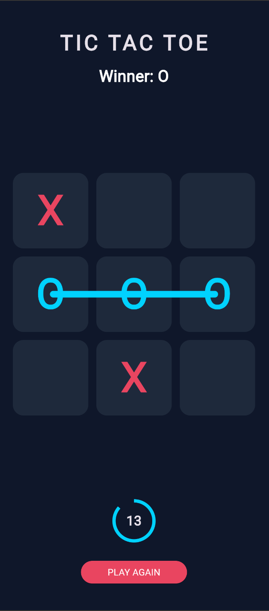

# ⚡ Neon Tic-Tac-Toe

A modern, high-fidelity Tic-Tac-Toe game built with **Flutter**. It features a neon dark-mode aesthetic, responsive layouts, and custom-painted animations.

## 🚀 Key Features
*   Neon UI: Deep midnight theme with Pink (X) and Cyan (O) accents.
*   Animated Strike: A dynamic line "draws" itself across the winning tiles.
*   Smart Timer: 15s move timer that stays idle until the first tap.
*   Responsive: Adaptive design for Web, Mobile, and Tablet.

## 🛠️ Tech Stack
*   Framework: Flutter (Dart)
*   Animations: Implicit (AnimatedScale) & Explicit (CustomPainter).
*   State: Encapsulated logic with automatic memory cleanup (Dispose).

---

## 📸 Screenshots

| Start Screen | Active Gameplay | Winning State |
| :---: | :---: | :---: |
|  |  |  |

## 🔧 Installation
1.  Clone: `git clone https://github.com/saianirudh-t/tictactoe.git`
2.  Dependencies: `flutter pub get`
3.  Run: `flutter run`

---

